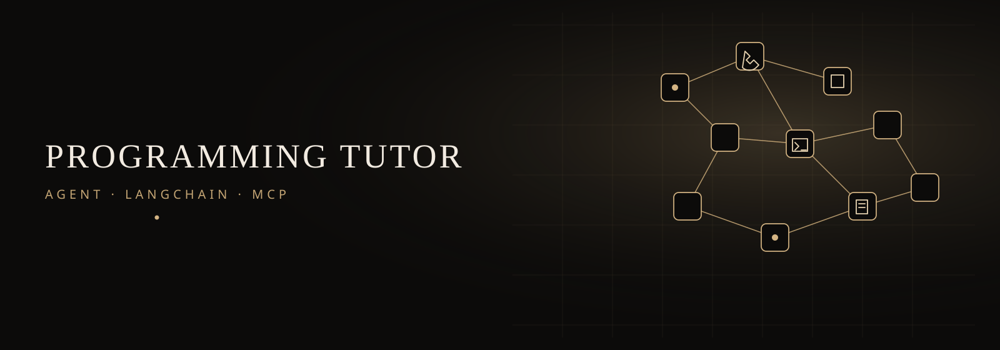
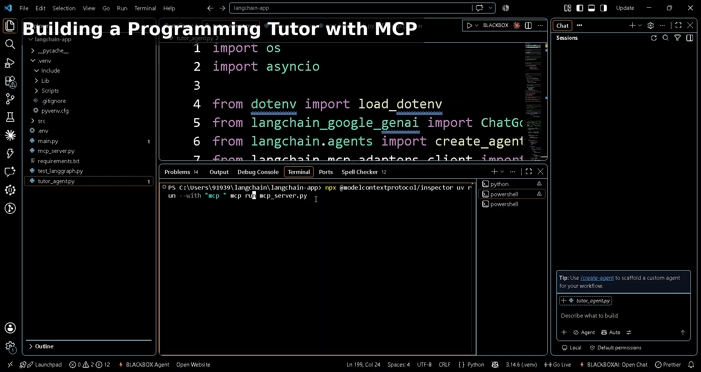
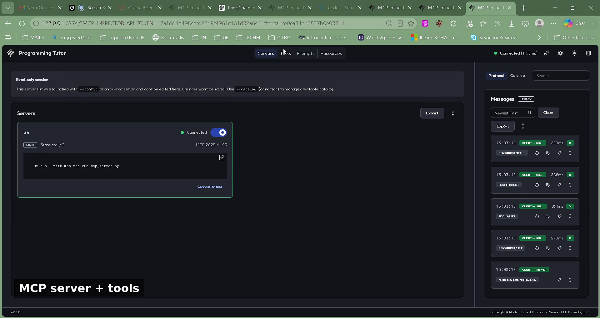
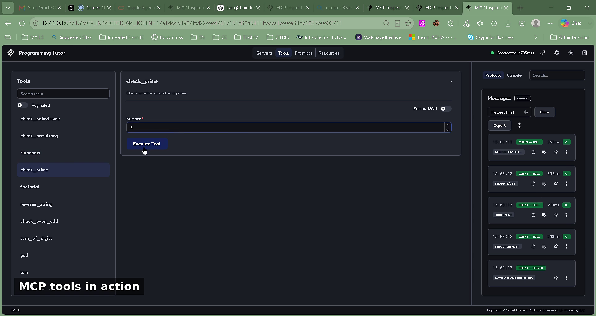
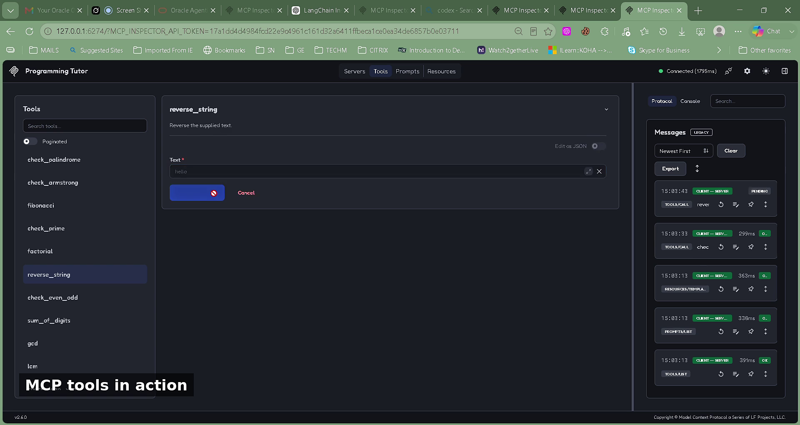
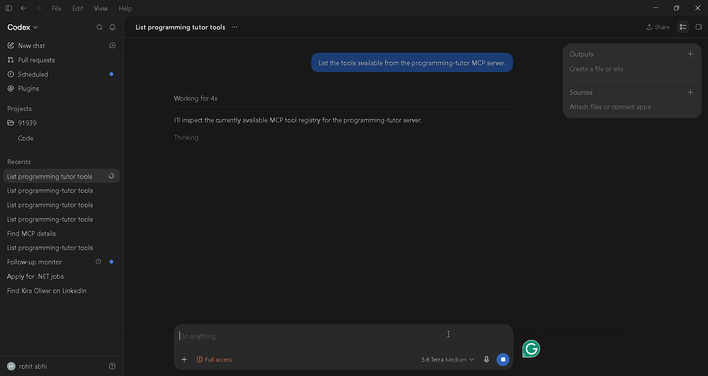
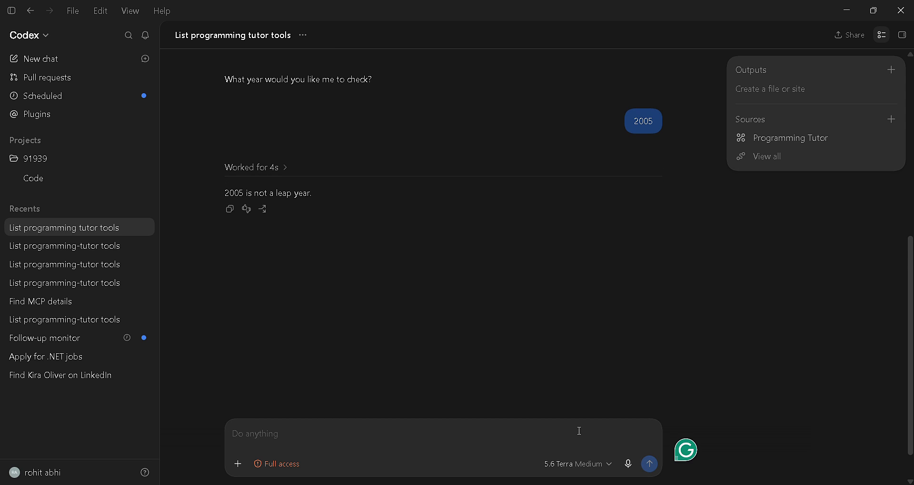

<p align="center">
  
</p>

# AI Tutor Agent

Python programming tutor built with LangChain, Gemini, and MCP tools.

The agent answers coding questions. When a question needs a check
(palindrome, prime, Fibonacci, GCD, and similar), it calls tools from
`mcp_server.py` and then explains the result in plain language.

## Demo

**[Watch on Google Drive](https://drive.google.com/file/d/1X8HZTsvx9oTEdc2P6xVx4szGgzhltDgM/view?usp=sharing)**

Preview player:
https://drive.google.com/file/d/1X8HZTsvx9oTEdc2P6xVx4szGgzhltDgM/preview

Also on GitHub:
[demo.mp4](https://github.com/rohit-dev45/programming-tutor-agent/blob/main/docs/programming-tutor-agent/docs/demo.mp4)













What the demo shows:

1. Project files in VS Code (`tutor_agent.py`, `mcp_server.py`)
2. MCP Inspector connected to **Programming Tutor**
3. Live tool runs: `check_prime(6)`, `reverse_string("hello")`, `sum_of_digits`
4. Codex listing all 13 tools and `check_leap_year(2005)` → not a leap year

## Stack

- LangChain `create_agent`
- Gemini (`gemini-2.5-flash`)
- MCP server (`FastMCP`) over stdio
- LangGraph smoke test in `test_langgraph.py`

## Setup

```bash
cd programming-tutor-agent
python -m venv .venv
source .venv/bin/activate
pip install -r requirements.txt
cp .env.example .env
```

```
GOOGLE_API_KEY=your_key
```

## Run

```bash
python main.py
python tutor_agent.py
python test_langgraph.py
python mcp_server.py
```

## MCP Inspector

```bash
npx @modelcontextprotocol/inspector python mcp_server.py
```

## Same tools from Codex / Cursor

Use `mcp.json` so the client can call the programming-tutor server.

- List the tools available from the programming-tutor MCP server
- `check_leap_year` for `2005` → not a leap year

## MCP tools

- `check_palindrome`
- `check_armstrong`
- `fibonacci`
- `check_prime`
- `factorial`
- `reverse_string`
- `check_even_odd`
- `sum_of_digits`
- `gcd`
- `lcm`
- `check_leap_year`
- `count_vowels`
- `check_anagram`
